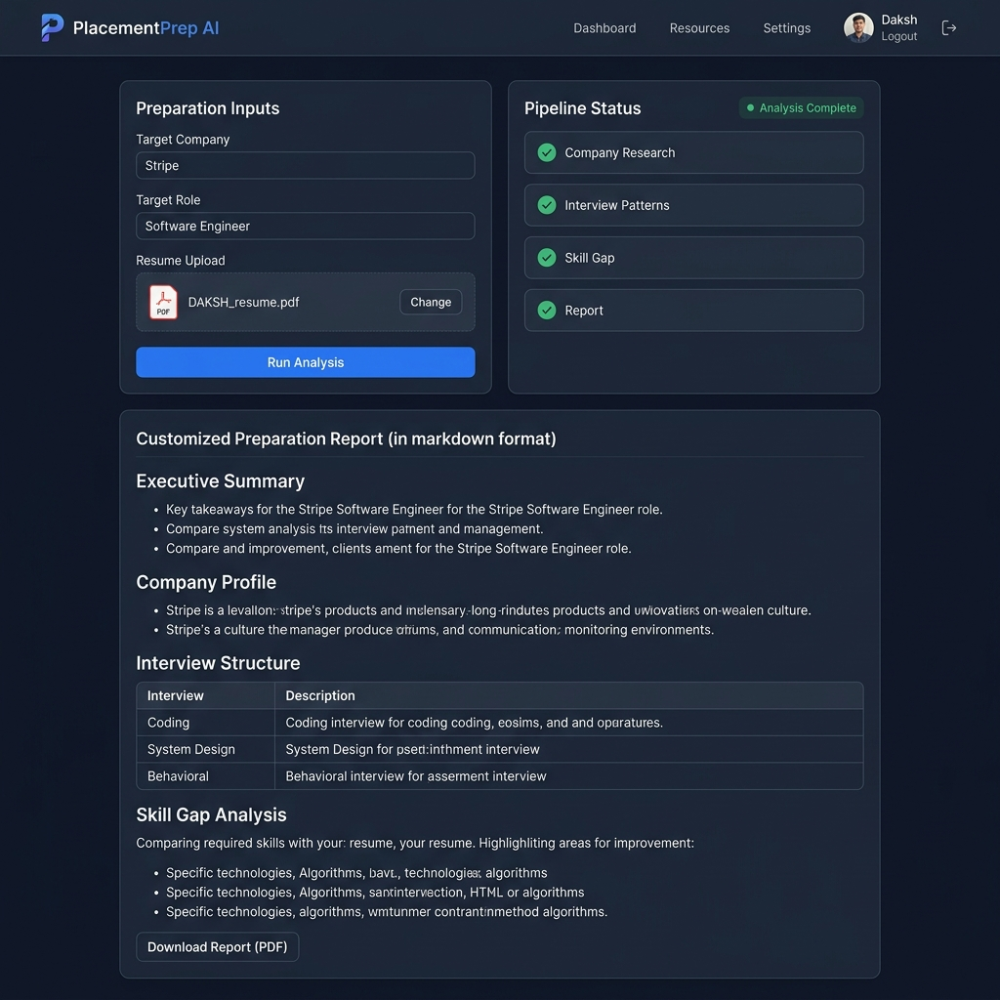

# RoleFit AI
> **Live Demo:** [https://rolefit-ai.vercel.app/](https://rolefit-ai.vercel.app/)

RoleFit AI is a multi-agent placement research assistant that automates corporate intelligence gathering, interview mining, and resume-JD alignment. It conducts deep research on target companies, scrapes community forums for interview patterns, maps candidate skill gaps, and generates a structured day-by-day preparation schedule with interactive action checklists.

[](https://www.python.org/)
[](https://fastapi.tiangolo.com/)
[](https://react.dev/)
[](https://vitejs.dev/)
[](https://langchain.com/)
[](https://ai.google.dev/)

---

## 📸 Application Screenshot



---

## 💡 Why This Project?

Unlike typical corporate research tools that print generic trivia, **RoleFit AI places the candidate's custom background at the center of the prep pipeline.** 

By executing a specialized **Resume-JD Skill Gap Analysis**, the system:
1. Performs a line-by-line comparison of candidate projects and tools against specific technical requirements in the Job Description.
2. Formulates an **Estimated Readiness Score** based on direct stack overlap.
3. Automatically adapts a **14-day study plan** focusing exclusively on bridging identified gaps (e.g., PostgreSQL DB connectivity, distributed transactions, scale systems).
4. Generates an **Interactive Action Checklist** persisted in browser `localStorage` to track task completion as the user gets interview-ready.

---

## 🏗️ Architecture Diagram

```text
               +----------------------------------------+
               |             React Frontend             |
               |            (Vite on Port 5173)         |
               +-------------------+--------------------+
                                   |
                  POST /analyze    |  Server-Sent Events (SSE)
                  (Form + PDF)     |  [Progress & Final Report JSON]
                                   v
               +-------------------+--------------------+
               |            FastAPI Backend             |
               |          (Uvicorn on Port 8000)        |
               +-------------------+--------------------+
                                   |
                  Orchestrates 4-Step Pipeline Flow:
                                   |
      Step 1: Company Research Agent (Tavily Search + Gemini LLM)
                                   |
      Step 2: Interview Pattern Agent (Reddit/Glassdoor/LeetCode Discuss scraping)
                                   |
      Step 3: Skill Gap Chain (Custom parsing: Resume PDF vs. Pasted JD)
                                   |
      Step 4: Report Writer Chain (Side-by-side comparison table compiling)
```

---

## 🛠️ Setup & Local Installation

### 1. Clone the Repository
```bash
git clone https://github.com/dakshgola/RoleFit-AI.git
cd RoleFit-AI
```

### 2. Backend Setup (FastAPI)
1. Navigate to the root directory and create a virtual environment:
   ```bash
   python -m venv venv
   source venv/bin/activate  # On Windows: .\venv\Scripts\Activate.ps1
   ```
2. Install dependencies:
   ```bash
   pip install -r requirements.txt
   ```
3. Set up environment variables inside a new `.env` file in the root directory:
   ```env
   GEMINI_API_KEY=your-gemini-api-key-here
   TAVILY_API_KEY=your-tavily-api-key-here
   ```
4. Run the FastAPI development server:
   ```bash
   uvicorn backend.main:app --host 127.0.0.1 --port 8000 --reload
   ```
   The backend will be live at `http://127.0.0.1:8000`.

### 3. Frontend Setup (Vite + React)
1. Navigate to the `frontend/` folder:
   ```bash
   cd frontend
   ```
2. Install NPM packages:
   ```bash
   npm install
   ```
3. Set up frontend configuration:
   Create a `.env.local` inside `frontend/` (if pointing to a custom hosted backend URL):
   ```env
   VITE_API_URL=http://localhost:8000
   ```
4. Launch the Vite development server:
   ```bash
   npm run dev -- --host 127.0.0.1 --port 5173
   ```
   Open your browser and navigate to `http://127.0.0.1:5173`.

---

## 🚀 Cloud Deployment

### 1. Backend Deployment (Render)
1. Create an account on [Render](https://render.com/).
2. Click **New** -> **Web Service** and connect this repository.
3. Configure the following build settings:
   - **Environment**: `Python`
   - **Build Command**: `pip install -r requirements.txt`
   - **Start Command**: `uvicorn backend.main:app --host 0.0.0.0 --port $PORT`
4. Add the following **Environment Variables** in Render's settings:
   - `GEMINI_API_KEY`
   - `TAVILY_API_KEY`
5. Note the deployed URL (e.g. `https://rolefit-ai-backend.onrender.com`).

### 2. Frontend Deployment (Vercel)
1. Create an account on [Vercel](https://vercel.com/).
2. Click **Add New** -> **Project** and import this repository.
3. In the project configure settings:
   - **Root Directory**: Select `frontend/`
   - **Framework Preset**: `Vite`
4. In the **Environment Variables** section, add:
   - `VITE_API_URL` = (Your Render backend URL, e.g. `https://rolefit-ai-backend.onrender.com`)
5. Click **Deploy**.

---

> [!NOTE]
> **API limits and safeguards**:
> - **Gemini free tier**: check current RPM/RPD limits at ai.google.dev before running a live demo.
> - **Tavily free tier**: 1000 searches/month — each analysis run uses ~2-3 searches.
